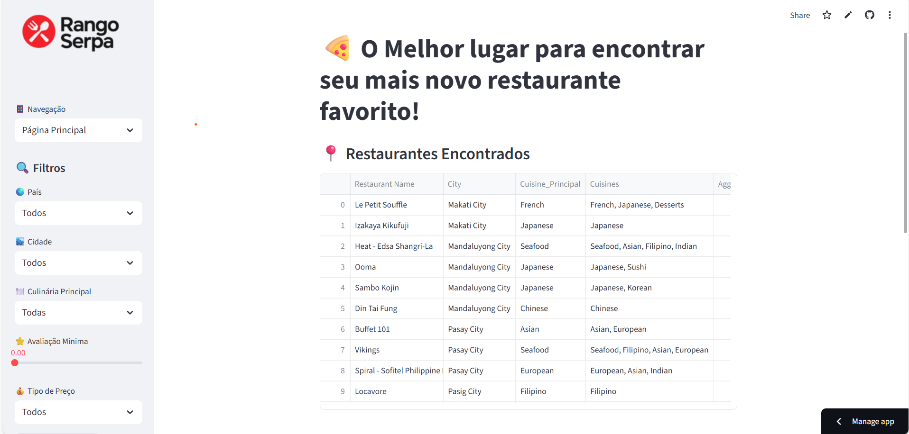
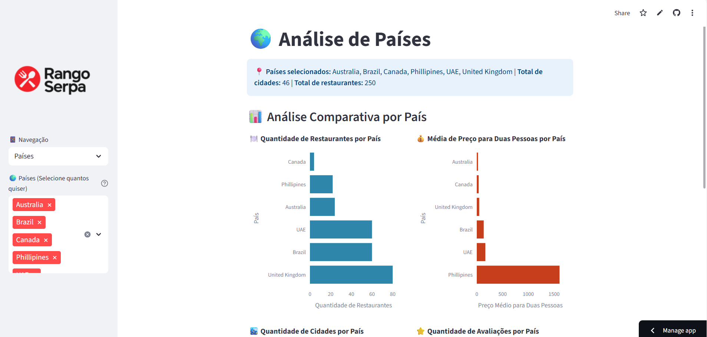
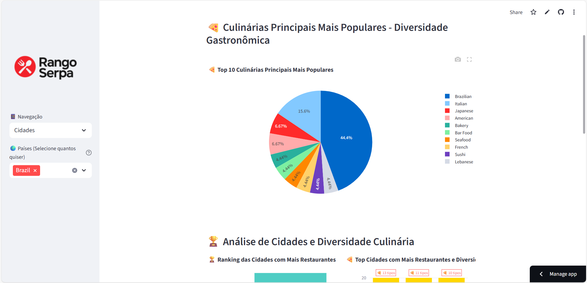

# 🍕 Dashboard Rango Serpa - Análise de Restaurantes

Dashboard interativo desenvolvido em **Streamlit** para análise de dados de restaurantes do **Rango Serpa**.

## 🚀 Como Executar

### **🌐 Acesse o Dashboard Online:**
**[🍕 Dashboard Rango Serpa - Streamlit Cloud](https://rangoserpa.streamlit.app/)**

### **💻 Executar Localmente:**

1. **Clone o repositório**
```bash
git clone https://github.com/leoserpaa/Rango-Serpa.git
cd Rango-Serpa
```

2. **Instale as dependências**
```bash
pip install -r requirements.txt
```

3. **Execute o dashboard**
```bash
streamlit run Streamlit_project.py
```

## ✨ Funcionalidades

### 🏠 **Página Principal**
- Filtros por país, cidade, culinária, avaliação e preço
- Tabela de restaurantes filtrados
- Estatísticas gerais e filtradas

### 🌍 **Análise de Países**
- Filtro multi-seleção de países
- 4 gráficos: restaurantes, preços, cidades e avaliações por país

### 🏙️ **Análise de Cidades**
- Filtro por países selecionados
- 5 gráficos: culinárias populares, ranking de cidades, qualidade e diversidade

## 🖼️ Imagens do Projeto

### 📱 **Página Principal**


### 🌍 **Análise por Países**


### 🏙️ **Análise por Cidades**



## 🛠️ Tecnologias

- **Streamlit** - Interface web
- **Pandas** - Manipulação de dados
- **Plotly** - Gráficos interativos
- **Python 3.8+**

## 📁 Estrutura

```
projeto-rango-serpa/
├── Streamlit_project.py      # Aplicação principal
├── dataset_atualizado.csv    # Dataset dos restaurantes
├── requirements.txt          # Dependências
├── README.md                # Este arquivo
└── img/                     # Pasta de imagens
    ├── img1.png            # Logo do projeto
    ├── pagina_principal.png # Screenshot da página principal
    ├── analise_paises.png  # Screenshot da análise por países
    └── analise_cidades.png # Screenshot da análise por cidades
```

## 🎯 Objetivo do Projeto

Este projeto foi desenvolvido para treinar habilidades de:
- **Análise exploratória de dados**
- **Criação de dashboards interativos**
- **Manipulação de dados com Pandas**
- **Visualização de dados com Plotly**
- **Desenvolvimento de aplicações web com Streamlit**


## 👨‍💻 Desenvolvedor

**Leonardo Serpa** 

---


